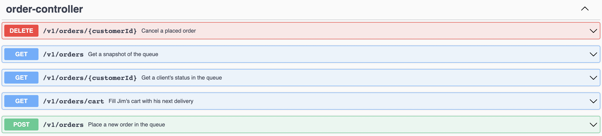

# Donut Priority Queue
> A RESTful Spring Boot Service that manages pending donut orders and helps Jim to deliver them

## Table of Contents
* [General Info](#general-information)
* [Technologies Used](#technologies-used)
* [Endpoints](#endpoints)
* [Setup / Installation](#setup--installation)
  * [Using maven plugin](#using-maven-plugin)
  * [Using direct jar](#using-direct-jar)
  * [Using direct jar with custom configuration](#using-direct-jar-with-custom-configuration)
* [Project Status](#project-status)
* [Contact](#contact)

## General Information
Jim works in the production facility of a premium online donut retailer. He is responsible for
bringing donuts to the pickup counter once they’re done. But the manager is not satisfied
because either it takes too long before a delivery arrives, or only a few items arrive. Jim’s
manager wants to fix this and asks Jim to write a web service that accepts the orders and
provides a list of items to deliver to the pickup counter.

## Technologies Used
- Java - version 11
- Spring Boot - version 2.6.7

## Endpoints


## Setup / Installation

### Using maven plugin
```
mvn spring-boot:run
```

### Using direct jar
```
java -jar donut-service-1.0-SNAPSHOT.jar
```

### Using direct jar with custom configuration
```
java -jar donut-service-1.0-SNAPSHOT.jar --spring.config.location=file://{file-path}/application.yml
```

## Project Status
Project is: _complete_.

## Contact
Created by [@lars-lewerenz](mailto:git.lars.lewerenz@gmail.com) - feel free to contact me!